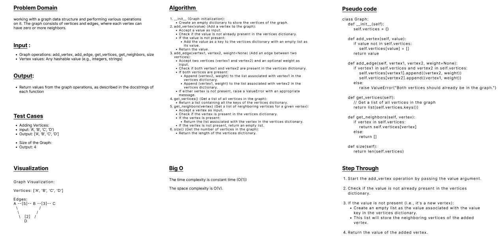

## Graphs
- Code Challenge 35 

 

---
 

## Code Challenge 35

### Features

#### Implement your own Graph. The graph should be represented as an adjacency list, and should include the following methods:
 

- add vertex
    - Arguments: value
    - Returns: The added vertex
    - Add a vertex to the graph

 

- add edge
    - Arguments: 2 vertices to be connected by the edge, weight (optional)
    - Returns: nothing
    - Adds a new edge between two vertices in the graph
    - If specified, assign a weight to the edge
    - Both vertices should already be in the Graph

 

- get vertices
    - Arguments: none
    - Returns all of the vertices in the graph as a collection (set, list, or similar)
    - Empty collection returned if there are no vertices

 

- get neighbors
    - Arguments: vertex
    - Returns a collection of edges connected to the given vertex
        - Include the weight of the connection in the returned collection
    - Empty collection returned if there are no vertices

 

- size
    - Arguments: none
    - Returns the total number of vertices in the graph
    - 0 if there are none

 

### Structure and Testing

#### Utilize the Single-responsibility principle: any methods you write should be clean, reusable, abstract component parts to the whole challenge. You will be given feedback and marked down if you attempt to define a large, complex algorithm in one function definition.

#### Be sure to follow your language/frameworks standard naming conventions (e.g. C# uses PascalCasing for all method and class names).

#### Any exceptions or errors that come from your code should be contextual, descriptive, capture-able errors. For example, rather than a default error thrown by your language, your code should raise/throw a custom error that describes what went wrong in calling the methods you wrote for this lab.

#### Write tests to prove the following functionality:
- Vertex can be successfully added to the graph
- An edge can be successfully added to the graph
- A collection of all vertices can be properly retrieved from the graph
- All appropriate neighbors can be retrieved from the graph
- Neighbors are returned with the weight between vertices included
- The proper size is returned, representing the number of vertices in the graph
- A graph with only one vertex and edge can be properly returned

 

### WhiteBoard
 

 

---
 

