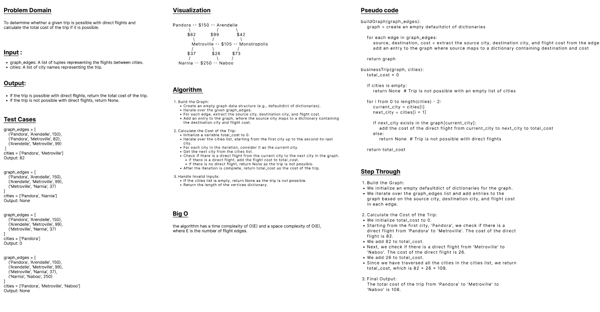

## Code Challenge 37

### Feature Tasks
- Write a function called business trip
- Arguments: graph, array of city names
- Return: the cost of the trip (if it’s possible) or null (if not)
#### Determine whether the trip is possible with direct flights, and how much it would cost.

<br>

### Structure and Testing
#### Utilize the Single-responsibility principle: any methods you write should be clean, reusable, abstract component parts to the whole challenge. You will be given feedback and marked down if you attempt to define a large, complex algorithm in one function definition.

#### Write at least three test assertions for each method that you define.

<br>

### Example
```
Pandora  -- $150 -- Arendelle
    \              /        \
     $82         $99         $42
       \         /             \
       Metroville -- $105 -- Monstropolis
       /         \           /
      $37         $26      $73
     /              \     /
   Narnia -- $250 -- Naboo
```
<br>

| Input	                             | Output |
| ---                                | ---    |
[Metroville, Pandora, ]	             | $82    |
[Arendelle, New Monstropolis, Naboo] | $115   |
[Naboo, Pandora]                     | null   |
[Narnia, Arendelle, Naboo]           | null   |

<br>

### Whiteboard
<br>



<br>

---
<br>

