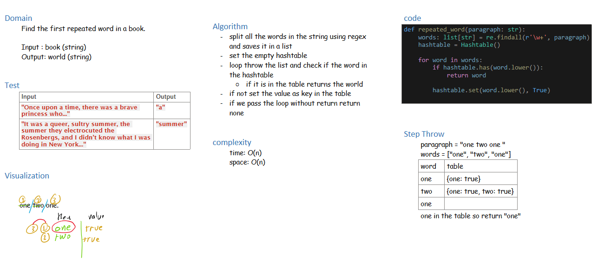

# class 31 - Repeated word

Find the first repeated word in a book.

## Whiteboard Process
<!-- Embedded whiteboard image -->

## Approach & Efficiency

time: O(n)
space: O(n)

## Solution

[Repeated word](./repeated_word.py)