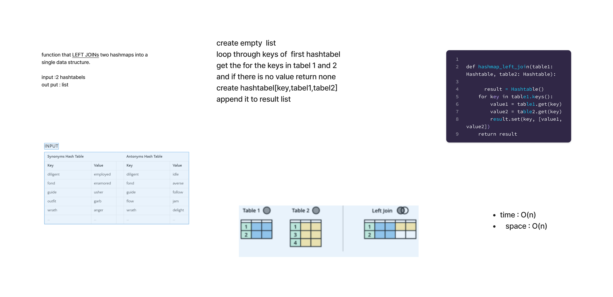

# class 33 - Hashmap Left Join

Implement a simplified LEFT JOIN for 2 Hashmaps.

## Whiteboard Process
<!-- Embedded whiteboard image -->

## Approach & Efficiency

time: O(n) because we loop throw the first hashmap once
space: O(n) because we created hashtable which will store the first hashmap values, and we have values values which can be the min(n, m) so in worse case it will be O(n)

## Solution

[hashmap left join](./hashmap_left_join.py)

[test](./test_hashmap_left_join.py)