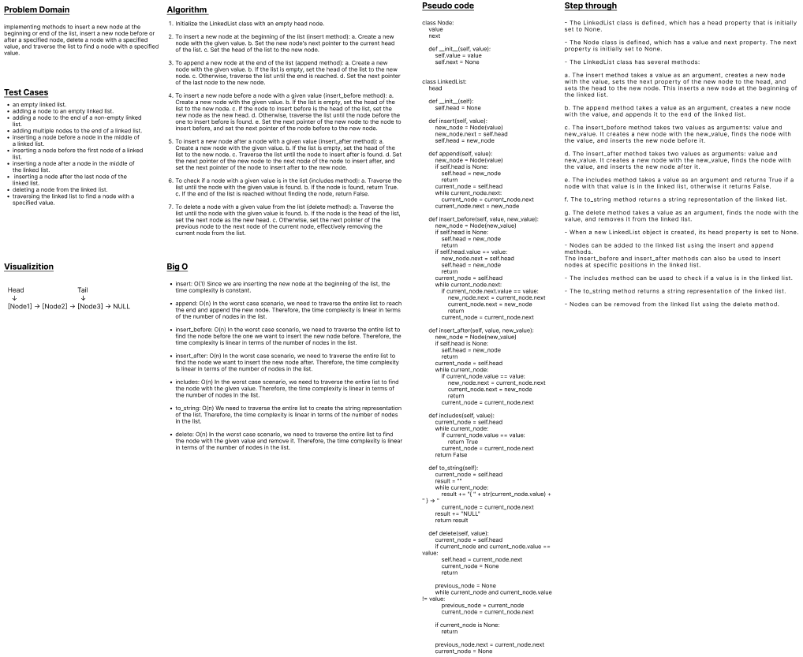

# class 05

Create linked-list that has the following methods:

insert(value) which adds a new node with the given value to the beginning of the list
includes(value) which returns a boolean result depending on whether that value exists as a Node’s value somewhere within the list
toString() which returns a string representing all the values in the Linked List, formatted as:
"{ a } -> { b } -> { c } -> NULL"

# class 06

Write the following methods for the Linked List class:

append

arguments: new value adds a new node with the given value to the end of the list

insert before

arguments: value, new value adds a new node with the given new value immediately before the first node that has the value specified

insert after

arguments: value, new value adds a new node with the given new value immediately after the first node that has the value specified
# WhiteBoard

