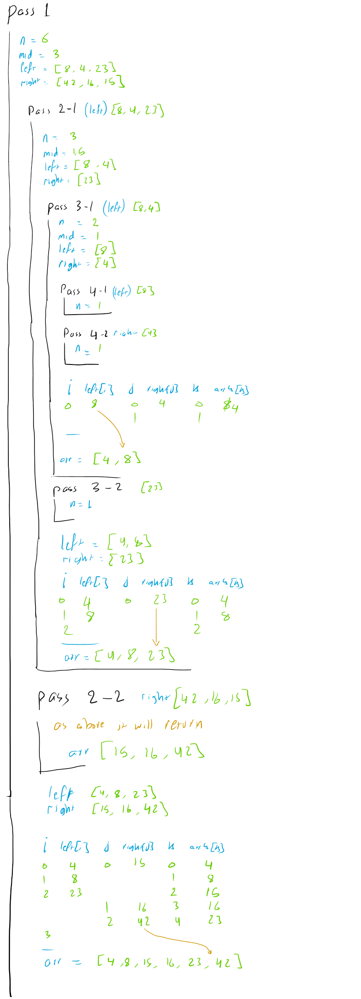

# Merge sort

Merge sort is a sorting technique based on divide and conquer technique. With worst-case time complexity being Ο(n log n), it is one of the most respected algorithms.

Merge sort first divides the array into equal halves and then combines them in a sorted manner.

## Pseudocode

```text

ALGORITHM Mergesort(arr)
    DECLARE n <-- arr.length

    if n > 1
      DECLARE mid <-- n/2
      DECLARE left <-- arr[0...mid]
      DECLARE right <-- arr[mid...n]
      // sort the left side
      Mergesort(left)
      // sort the right side
      Mergesort(right)
      // merge the sorted left and right sides together
      Merge(left, right, arr)

ALGORITHM Merge(left, right, arr)
    DECLARE i <-- 0
    DECLARE j <-- 0
    DECLARE k <-- 0

    while i < left.length && j < right.length
        if left[i] <= right[j]
            arr[k] <-- left[i]
            i <-- i + 1
        else
            arr[k] <-- right[j]
            j <-- j + 1

        k <-- k + 1

    if i = left.length
       set remaining entries in arr to remaining values in right
    else
       set remaining entries in arr to remaining values in left
```

## Trace

Sample Array: [8,4,23,42,16,15]



## Approach & Efficiency

- Time: O(nlogn)
- Space: O(n)

## Solution

[solution](./merge_sort.py)

[test](./tests/test_merge_sort.py)