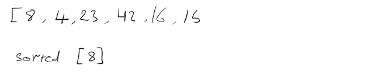
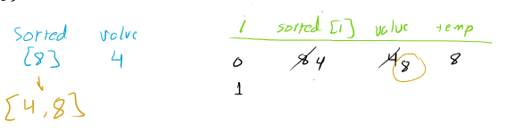
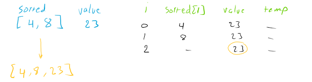
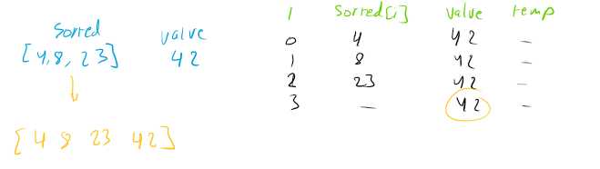
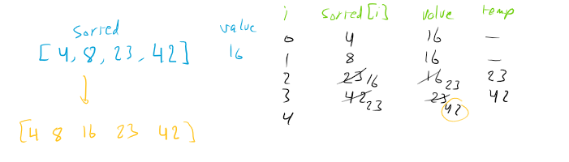
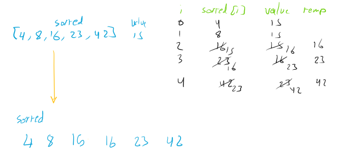

# Insertion Sort

Insertion sort is a comparison-based sorting algorithm that builds the final sorted array one element at a time. It works by repeatedly taking an element from the unsorted part of the array and inserting it into its correct position in the sorted part of the array.

## Pseudocode

```text
Insert(int[] sorted, int value)
  initialize i to 0
  WHILE value > sorted[i]
    set i to i + 1
  WHILE i < sorted.length
    set temp to sorted[i]
    set sorted[i] to value
    set value to temp
    set i to i + 1
  append value to sorted

InsertionSort(int[] input)
  LET sorted = New Empty Array
  sorted[0] = input[0]
  FOR i from 1 up to input.length
    Insert(sorted, input[i])
  return sorted
```

## Trace

Sample Array: [8,4,23,42,16,15]


Pass 1:


in the first we started with the first element in the array and we compare it with the second element if the first element is greater than the second element we swap them and we continue to compare the first element with the next element until we find the right place for the first element.

Pass 2:


It then considers the next element and compares it to the elements in the sorted portion of the array, moving elements greater than the current element one position to the right.

pass 3:


pass 4:


pass 5:


## Approach & Efficiency

- Time: O(n^2)
- Space: O(n)

## Solution

[solution](./insertion_sort.py)

[test](./tests/test_insertion_sort.py)