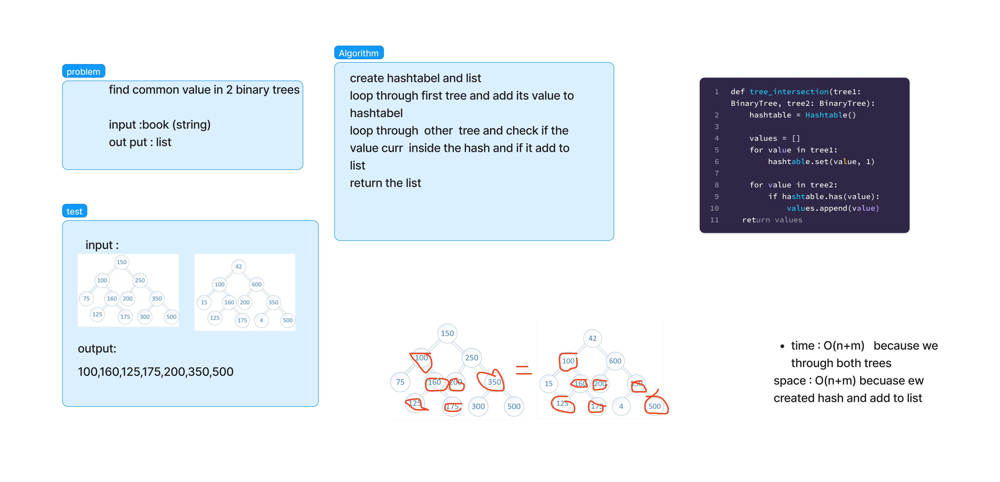

# class 32 - Tree intersection

Find common values in 2 binary trees.

## Whiteboard Process
<!-- Embedded whiteboard image -->

## Approach & Efficiency

time: O(n + m) because we loop throw both of the trees once
space: O(n + m) because we created hashtable which will store the first tree values, and we have values values which can be the min(n, m) so in worse case it will be O(n + m)

## Solution

[Tree Intersection](./tree_intersection.py)
[test](./tests/test_tree_intersection.py)