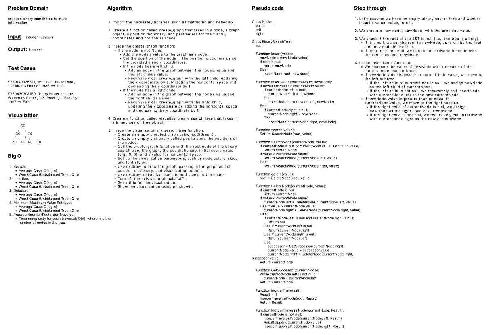

# whiteboard



# Approach and effiency

create Node class, Binary Tree class and Binary search class

# Solution
  

```python

class Node:
    def __init__(self, value):
        self.value = value
        self.left = None
        self.right = None


class BinaryTree:
    def __init__(self):
        self.root = None

    def preorder_traversal(self, node):
      

        if node is None:
            return []
        result = [node.value]
        result += self.preorder_traversal(node.left)
        result += self.preorder_traversal(node.right)
        return result

    def inorder_traversal(self, node):
        

        if node is None:
            return []
        result = self.inorder_traversal(node.left)
        result.append(node.value)
        result += self.inorder_traversal(node.right)
        return result

    def postorder_traversal(self, node):
      

        if node is None:
            return []
        result = self.postorder_traversal(node.left)
        result += self.postorder_traversal(node.right)
        result.append(node.value)
        return result


class BinarySearchTree(BinaryTree):
    def add(self, value):
      

        if self.root is None:
            self.root = Node(value)
        else:
            self._add_helper(self.root, value)

    def _add_helper(self, node, value):
       

        if value < node.value:
            if node.left is None:
                node.left = Node(value)
            else:
                self._add_helper(node.left, value)
        else:
            if node.right is None:
                node.right = Node(value)
            else:
                self._add_helper(node.right, value)

    def contains(self, value):
       

        return self._contains_helper(self.root, value)

    def _contains_helper(self, node, value):
        
        if node is None:
            return False
        if value == node.value:
            return True
        if value < node.value:
            return self._contains_helper(node.left, value)
        else:
            return self._contains_helper(node.right, value)
```