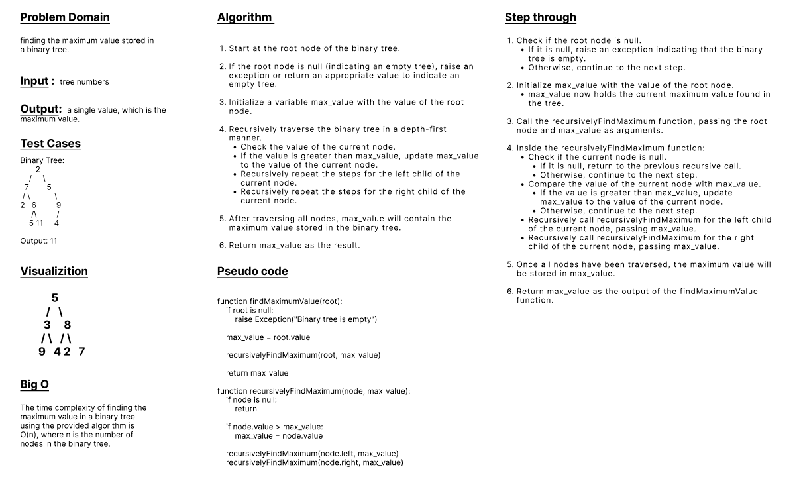

# whiteboard



# Approach and effiency

find maximum vlaue in binary tree

# Solution
   
   ```python

   from binarytree.binarytre import *


class BinaryTree:
    def __init__(self):
        self.root = None

    def find_maximum_value(self):
      
        if self.root is None:
            raise Exception("Binary tree is empty")

        return self._find_maximum_value_helper(self.root)

    def _find_maximum_value_helper(self, node):
       
        if node is None:
            return float("-inf")

        max_value = node.value
        left_max = self._find_maximum_value_helper(node.left)
        right_max = self._find_maximum_value_helper(node.right)

        if left_max > max_value:
            max_value = left_max
        if right_max > max_value:
            max_value = right_max

        return max_value

        ```